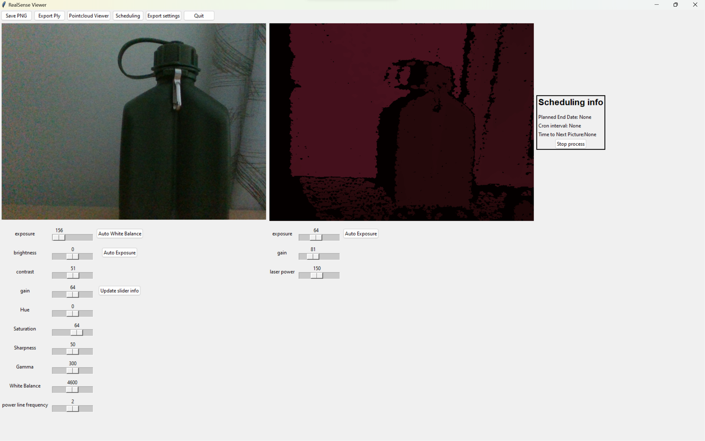

# Project 4 Stereo Camera Biomass GUI



## Description

this is a gui for the stereo camera biomass project, it is written in python and uses tkinter for the gui we use the pyrealsense2 library for the realsense camera povided by intel.

the GUI is used to control the camera and the data collection process.

we recommend using a windows computer to run the program, people one our team have had issues with the realsense dependency on mac, we havent tried with linux but it should work.

## Getting Started

make sure u have [python 3.8.10](https://www.python.org/downloads/release/python-3810/) or higher is installed on your computer

make sure to install the dependencies before running the program

### Dependencies

* python 3.8.10 or higher (we recommend using 3.11.6)
  
* pyrealsense2

* tkinter

* numpy

* opencv-python

* PILLOW
  
* croniter

* subprocess

```cmd

pip install -r requirements.txt

```

after installing the dependencies you can run the program by running the main.py file

```cmd

python main.py

```


## Features

* [X] **Manipulation of Camera Parameters**
  * Ability to adjust exposure, focus, and white balance.
  > in the gui you can adjust the exposure, brightness, and white balance of the camera thru the sliders this might take a second to update the camera
  

* [X] **Viewers for RGB Module and DoF Module (Point Cloud)**
  * Separate viewers for RGB images and Depth of Field point cloud data.
  > the gui has two canvases one for the rgb image and one for depth image
   there is a live point cloud viewer that shows the point cloud data in real time
  

* [ ] **Connection to Camera via Network**
  * Real-time view of the camera for image acquisition.
  
```diff
- this feature is not yet implemented, we might not implement it due to the scale of this feature,
```

```diff
+  the functionality of this feature can be enhanced by using remote desktop software to connect to the computer running the program
```

* [X] **File Exporting**
  * Export captured RGB images and point cloud data to external storage.
  > the exported files are saved in the output folder in the project directory
  

* [X] **Scheduling of Snapshots and Exports**
  * Schedule automated snapshots and exports at specified intervals.
  > this feature uses croniter so you need to use the cron syntax to schedule the snapshots and exports
  a good website to use to test the cron syntax is [crontab.guru](https://crontab.guru/)
  when clicking the button in the top bar will open a window where you can schedule the snapshots and exports
    
  after scheduling the snapshots and exports you can see the scheduled jobs on the screen  
    
  you can also stop the scheduled jobs by clicking the stop button  
  

